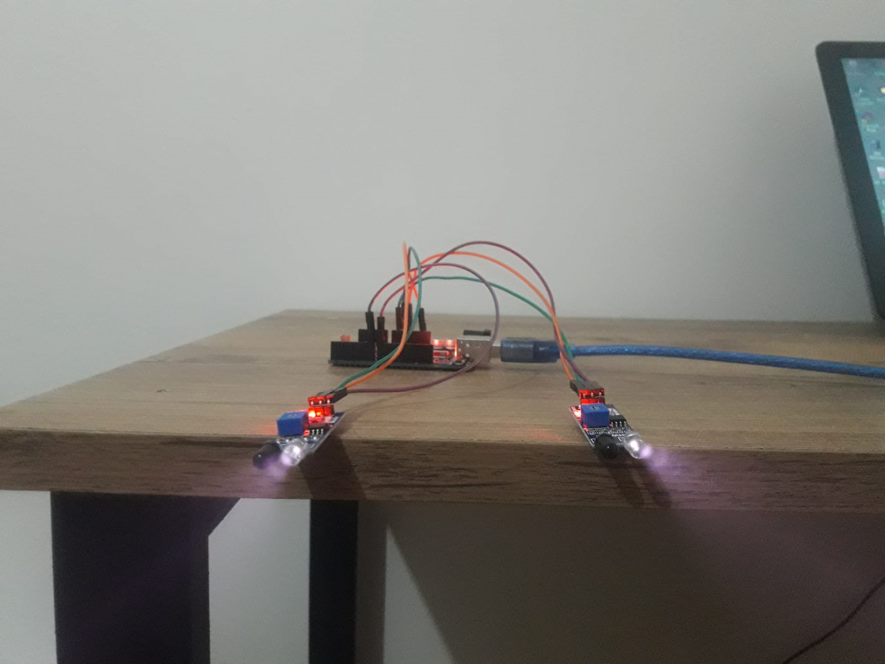
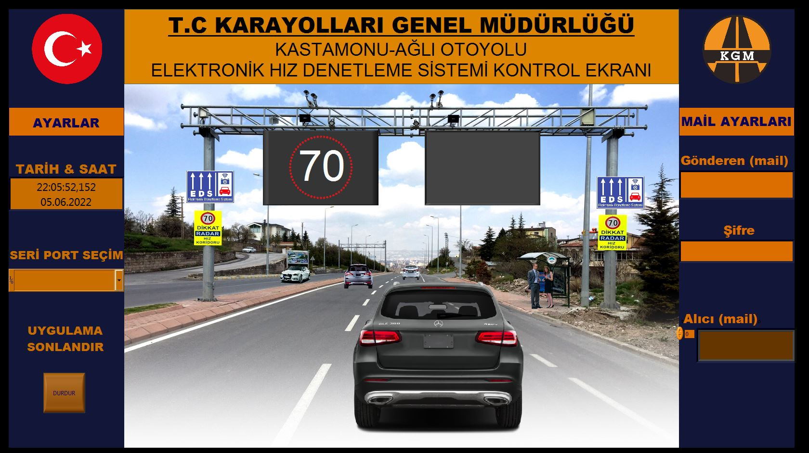
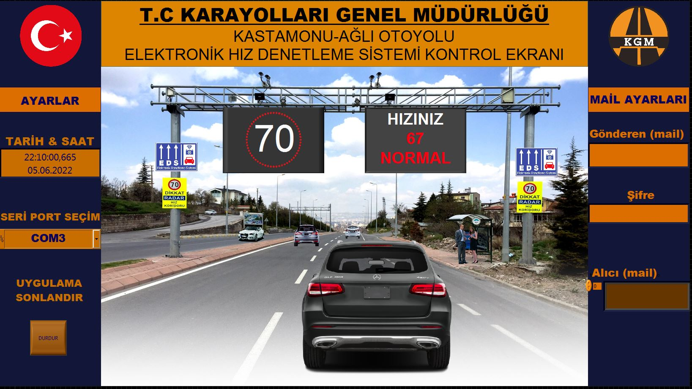
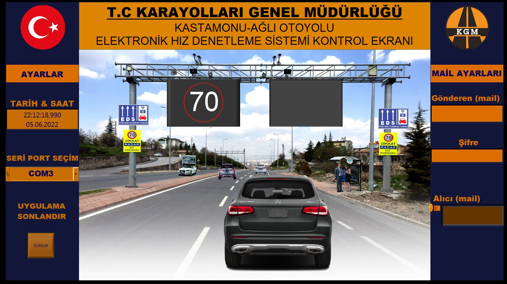
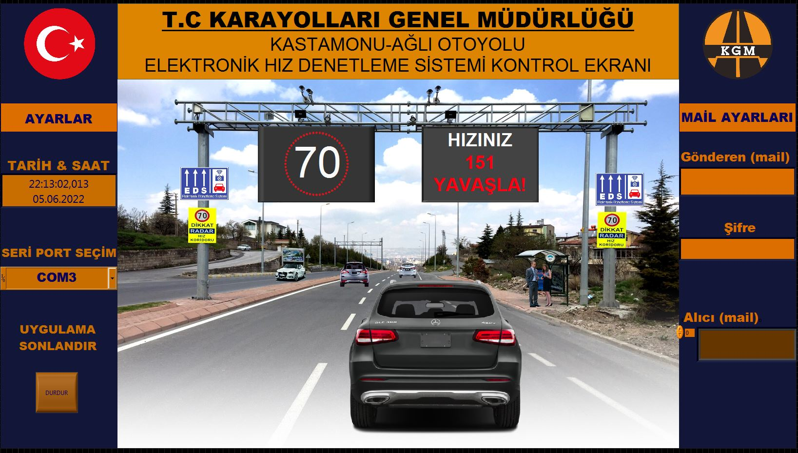
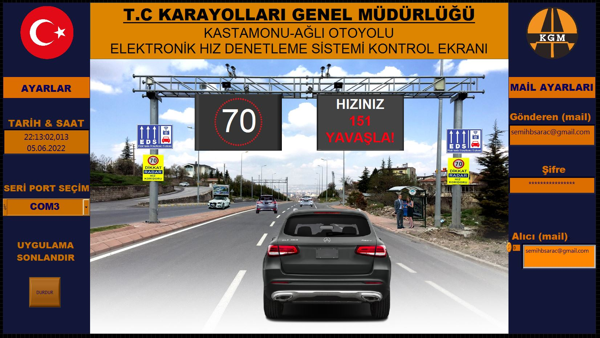
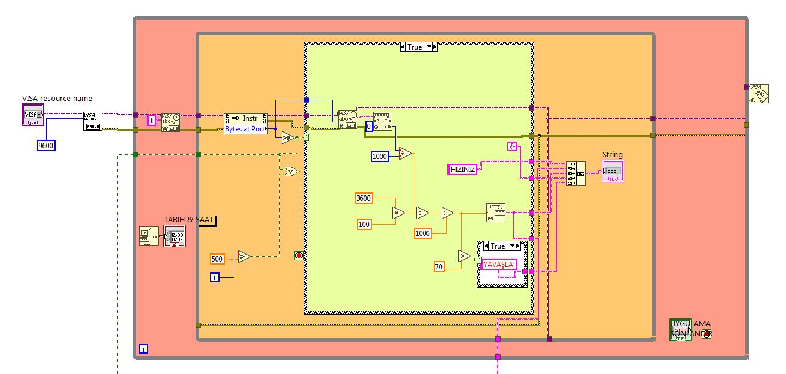
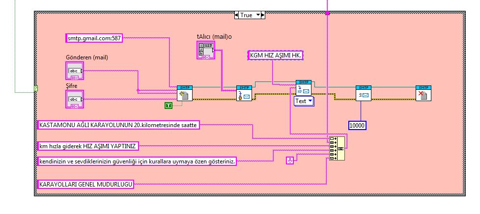

**ARAÇ HIZI DENETİM UYGULAMASI**

*Özet*

Bu projede geçen araçların hızının algılanması için uygulamada 200 metre aralıklarla yerleştirilmesi planlanan IR Alıcı Verici iki modül ile bu sensörlerden gelen interruptların arasında geçen sürenin hesaplanarak kullanıcının hızının belirlenmesi ve bunun LabVIEW ortamına seri port üzerinden aktarılmış, sade ve anlaşılır bir arayüz üzerinden kullanıcının hızı görüntülenmiştir.

*Amaç*

Hız sınırı bulunan yollarda; sensörlerle kullanıcının hızının belirlenmesi ve sınırı aşan kullanıcıların yoldaki ekranda hızı gösterilerek uyarılması ve ortamda bulunan kameralardan yararlanarak plaka tanıma sistemi ile araç sahibinin sistemde bulunan mail adresine yaptığı hız ihlalinin bildirilmesi.

*Yazılım*

-   Arduino

-   LabView

*Sensörler*

-   IR Alıcı Verici Modül

*Protokol*

-   UART

-   SMTP

*Atmega Denetleyicisinin için kod yazılması*

1.  Global değişkenlerin tanımlanması ve void setup() içinde programın başlangıç parametreleri (pin tanımlamaları, seri haberleşme başlangıcı) gibi tanımlamaların yapılması. Değişken tanımlamalarında Hungarian Notation kullanıldı.

``` arduino
int firstIR = 7;
int secondIR = 8;
int firstPass, lastPass;
int fpTime, spTime;
int fpCount, spCount = 0;
int difTime;

void setup(){

pinMode(firstIR, INPUT);  // Sensors are input
pinMode(secondIR, INPUT);
Serial.begin(9600);

}
```

2.  Sonrasında sürekli yapılacak işlemler loop yapısı içerisinde gerçekleştirildi. Sensör algılama durumunda boolean 0 çıkışı verdiği için algılama durumu için sıfıra eşitlik şartı arandı. İki olay arası süre denetleyicini çalışmasından itibaren geçen süreyi milisaniye cinsinden sayan millis() fonksiyonu ile hesaplandı. Sürenin hesaplanmasının ikinci sensör okumasından sonra yapılması için işlemler ikinci sensörün algılanmasıyla ilgili blok içerisinde gerçekleştirildi. Geçen süre birkaç şart bloğundan sonra seri ekrana bastırıldı.

``` arduino
void loop() {

  firstPass = digitalRead(firstIR);

  if (firstPass == 0) {

    fpTime = millis();
    delay(100);
    fpCount++;

  }

  lastPass = digitalRead(secondIR);

  if (lastPass == 0) {

    spTime = millis();
    delay(100);
    spCount++;

    if (spCount == fpCount)
      if ((spCount || fpCount) != 0) {

        difTime = spTime - fpTime;
        Serial.println(difTime);
      }
  }

}
```

*Arduino UNO ve sensörler arası bağlantının yapılması*

{width="412"}

*LabVIEW'da oluşturulan arayüze ait front panel görüntüleri*

{width="399"}

-   İki sensörde herhangi bir algılama olmadığında ekranda herhangi bir görüntü yok.

{width="398"}

-   Araç geçip sensörler algılama yapınca aracın hızı ekrana yansıtıldı ve uyarı yapıldı.

{width="396" height="222"}

-   Uyarıdan sonra diğer araç geçişine kadar ekran yine boş olacak konuma getirildi.

{width="396" height="225"}

-   Diğer araç geçişinden sonra aracın hızı ve uyarı ekrana yansıtıldı.

{width="395"}

Ekranın sağ köşesinde SMTP protokolü ile oluşturulan email gönderme bloğu görüntülenmektedir. Şifre hassas bir veri olduğundan password display seçeneği yardımıyla gizlendi.

*Seri ekrandan veri alınıp işlenerek oluşturulan arayüze aktarılmasını gösteren blok diyagram*



-   Seri port seçimi ve veri alınması ardından da alınan verinin çeşitli oran orantı hesaplarıyla saniye ve ardından saatteki hıza çevrilmesi

-   Ardından verinin string türüne çevrilerek kullanıcın anlayıcağı formata getirilmesi için açıklayıcı string ifadeleriyle concantrated string aracılığla toplanarak indicator nesnesiyle yazdırılması.



-   SMTP protokolü ile hız sınırının aşılması şartıyla gönderici hesaptan alıcı hesaba veri akışı sağlanması
